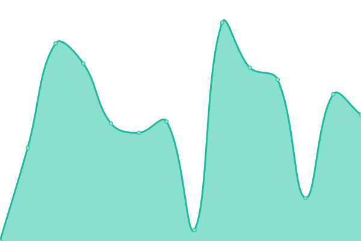
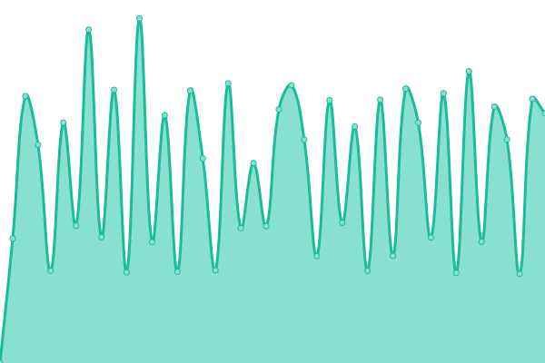

# [📈 Live Status](https://fideo.github.io/statusSites): <!--live status--> **🟧 Partial outage**

This repository contains the open-source uptime monitor and status page for [Federico Mazzei](https://www.federicomazzei.com.ar), powered by [Upptime](https://github.com/upptime/upptime).

With [Upptime](https://upptime.js.org), you can get your own unlimited and free uptime monitor and status page, powered entirely by a GitHub repository. We use [Issues](https://github.com/fideo/statusSites/issues) as incident reports, [Actions](https://github.com/fideo/statusSites/actions) as uptime monitors, and [Pages](https://fideo.github.io/statusSites) for the status page.

<!--start: status pages-->
<!-- This summary is generated by Upptime (https://github.com/upptime/upptime) -->
<!-- Do not edit this manually, your changes will be overwritten -->
<!-- prettier-ignore -->
| URL | Status | History | Response Time | Uptime |
| --- | ------ | ------- | ------------- | ------ |
|  [FedericoMazzei](https://www.federicomazzei.com.ar) | 🟩 Up | [federico-mazzei.yml](https://github.com/fideo/statusSites/commits/HEAD/history/federico-mazzei.yml) | 

 1011ms
     
 | 

<a href="https://fideo.github.io/statusSites/history/federico-mazzei">100.00%</a>
    

|  [AdolfoOrtizCubas](https://www.adolfoortizcubasfabricademuebles.com.ar) | 🟥 Down | [adolfo-ortiz-cubas.yml](https://github.com/fideo/statusSites/commits/HEAD/history/adolfo-ortiz-cubas.yml) | 

 6188ms
     
 | 

<a href="https://fideo.github.io/statusSites/history/adolfo-ortiz-cubas">94.48%</a>
    

|  [MetalurgicaMiele](https://www.metalurgicamiele.com.ar) | 🟩 Up | [metalurgica-miele.yml](https://github.com/fideo/statusSites/commits/HEAD/history/metalurgica-miele.yml) | 

 4199ms
     
 | 

<a href="https://fideo.github.io/statusSites/history/metalurgica-miele">99.85%</a>
    

|  [Distribuidora RN](https://www.distribuidorarn.com.ar) | 🟩 Up | [distribuidora-rn.yml](https://github.com/fideo/statusSites/commits/HEAD/history/distribuidora-rn.yml) | 

 3568ms
     
 | 

<a href="https://fideo.github.io/statusSites/history/distribuidora-rn">100.00%</a>
    

|  [Argenchemical SRL](https://www.argenchemical.com.ar) | 🟩 Up | [argenchemical-srl.yml](https://github.com/fideo/statusSites/commits/HEAD/history/argenchemical-srl.yml) | 

 1974ms
     
 | 

<a href="https://fideo.github.io/statusSites/history/argenchemical-srl">99.55%</a>
    

<!--end: status pages-->

[**Visit our status website →**](https://fideo.github.io/statusSites)

## 📄 License

- Powered by: [Upptime](https://github.com/upptime/upptime)
- Code: [MIT](./LICENSE) © [Federico Mazzei](https://www.federicomazzei.com.ar)
- Data in the `./history` directory: [Open Database License](https://opendatacommons.org/licenses/odbl/1-0/)
